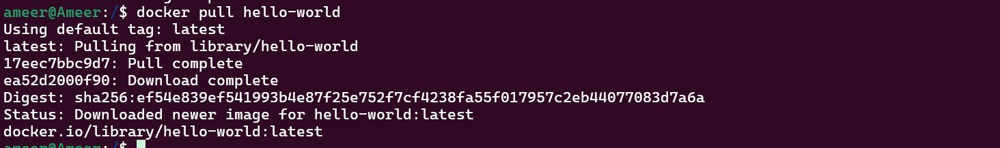
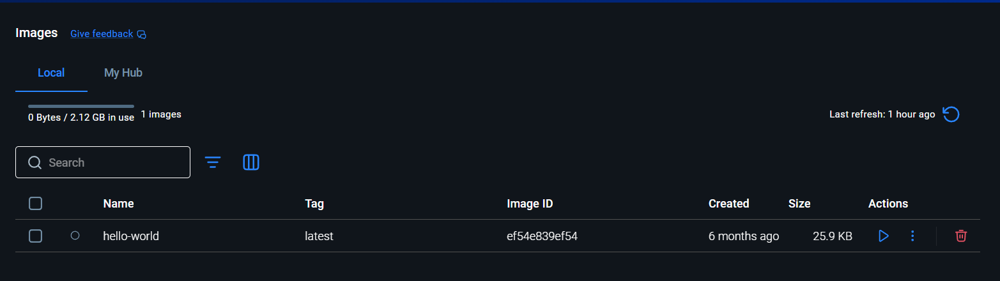
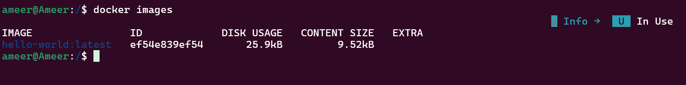
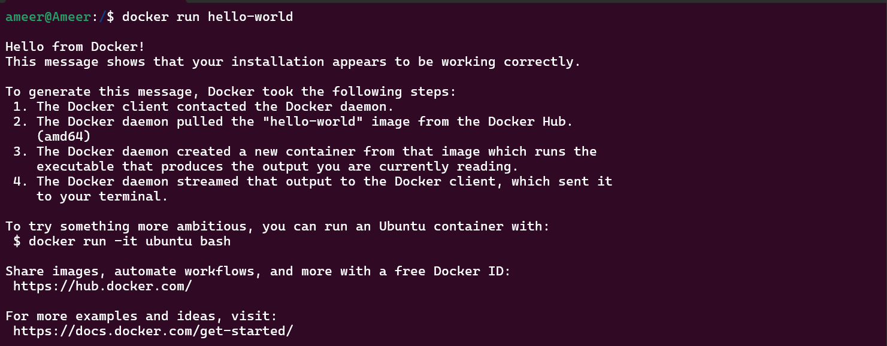
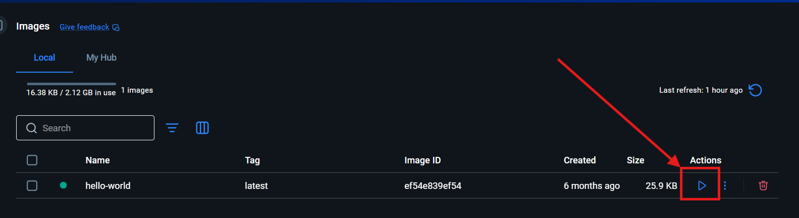
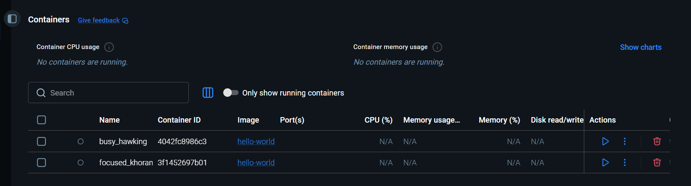

# What is Docker 

In traditional development, if Developer A builds a project using PHP, MySQL, and Apache, everything works perfectly on his system because he has already installed and configured those tools with specific versions. But when Developer B or 1000 other developers try to run the same project, they may not have PHP, MySQL, or Apache installed. Even if they install them, the versions may be different, leading to compatibility issues. Some developers may face configuration errors, missing dependencies, or operating system limitations. This process wastes a lot of time and creates frustration. Docker solves this problem by packaging the application along with its required software, dependencies, and configurations into a container. That container runs the same way on every computer, regardless of the operating system or installed software. Developers no longer need to manually install or configure everything — they simply run the Docker container, and the environment is ready instantly.


## ✨ Containerization

Containerization in Docker is the process of packaging an application along with all its dependencies (libraries, runtime, system tools, and configuration files) into a lightweight unit called a container. This container runs consistently across different environments like development, testing, and production. Docker ensures that the application behaves the same everywhere by isolating it from the host system while still sharing the host’s OS kernel. This solves environment mismatch problems and makes deployment faster and more reliable.

> Docker containers can run on Linux, macOS, and Windows,

Docker containers are built to run on a Linux kernel. On a Linux system, Docker runs natively because it directly uses the host’s Linux kernel. On macOS and Windows, however, Docker cannot run directly on the native OS kernel because they are not Linux-based. So Docker Desktop automatically creates a lightweight Linux **virtual machine** in the background (using tools like **WSL2** on Windows). The containers actually run inside that Linux environment, which makes them behave the same way across all operating systems. That is why we say Docker containers can “run anywhere” — because Docker ensures a consistent Linux environment on Linux, Mac, and Windows systems.

## ✨ Image 

A Docker image is a lightweight, read-only template that contains everything needed to run an application, including the code, runtime, system libraries, dependencies, and configuration files. It acts like a blueprint for creating Docker containers. When you run an image, Docker creates a container from it. Images are built using a `Dockerfile`, and they ensure that the application runs consistently across different environments. Because images are immutable (cannot be changed after creation), they provide stability and predictable deployments.


A Docker image is like a frozen pizza you buy from a supermarket. The frozen pizza already contains everything — base, sauce, cheese, toppings — all prepared and packaged. You don’t need to gather ingredients separately. When you put that frozen pizza into the oven and bake it, it becomes ready to eat. Similarly, a Docker image contains everything needed to run an application — code, runtime, libraries, and dependencies. When you “run” the image, Docker creates a container, just like baking the frozen pizza makes it ready to eat.


## ⭐ Why do we need Containers?

We need containers in software development to solve the problem of “it works on my machine.” Containers package an application along with all its dependencies, libraries, and configurations into a single portable unit. This ensures the application runs consistently across development, testing, and production environments. Containers are lightweight, fast, and efficient compared to traditional virtual machines, making them ideal for modern cloud-based and microservices architectures.

## ⭐ Bare Metal vs VM vs Containers

| Feature        | Bare Metal               | VM                     | Container         |
| -------------- | ------------------------ | ---------------------- | ----------------- |
| Performance    | ⭐⭐⭐⭐⭐                    | ⭐⭐⭐                    | ⭐⭐⭐⭐              |
| Isolation      | ❌ Low                    | ✅ High                 | ✅ Medium          |
| Resource Usage | Full Hardware            | Heavy                  | Lightweight       |
| Startup Time   | Minutes                  | Minutes                | Seconds           |
| Best For       | High performance systems | Enterprise legacy apps | Cloud-native apps |

## ⭐ Docker and OCI

Docker is a platform that allows developers to package applications along with all their dependencies into containers, so they can run consistently across different environments like development, testing, and production. It simplifies application deployment and improves portability.

The Open Container Initiative (OCI) is an industry body under the Linux Foundation that defines open standards for container image formats and runtimes. It ensures that containers created by one tool (like Docker) can run on other compatible platforms without issues, avoiding vendor lock-in and improving interoperability.

| Criteria              | Bare Metal | Virtual Machine | Container |
| --------------------- | ---------- | --------------- | --------- |
| Dependency Management | 🔴 Poor    | 🟢 Good         | 🟢 Good   |
| Utilization           | 🔴 Poor    | 🟡 Medium       | 🟢 Good   |
| Isolation             | 🟢 Good    | 🟢 Good         | 🟡 Medium |
| Start Up Speed        | 🔴 Slow    | 🟡 Medium       | 🟢 Fast   |
| Dev / Prod Parity     | 🔴 Poor    | 🟡 Medium       | 🟢 Good   |
| Control               | 🟢 High    | 🟡 Medium       | 🟡 Medium |
| Performance           | See note   | See note        | See note  |
| Operational Overhead  | 🔴 High    | 🟡 Medium       | 🟢 Low    |


## ⭐ Docker Commands

### ⚡ Pull Image
```cmd
docker pull hello-world
```

The command `docker pull hello-world` downloads the `hello-world` image from Docker Hub (Docker’s public image repository) to your local system. If the image is not already available on your machine, Docker contacts Docker Hub, finds the official `hello-world` image, downloads its layers, and stores it locally. This image is a very small test image used to verify that Docker is installed and working correctly.



### ⚡ Verify the Image 

verify in docker Software



Verify in Cmd

```cmd
docker images
``` 



### ⚡ Run Image
```cmd
docker run hello-world
```



you can run on docker software also



## ⭐ Docker Container

A Docker container is a lightweight, isolated, and runnable instance of a Docker image. It contains everything needed to execute an application, including code, runtime, libraries, and system tools. When you run a Docker image, Docker creates a container from it. Containers are isolated from each other and from the host system, but they share the host’s operating system kernel. They are fast, portable, and efficient, making them ideal for modern application development and deployment.




| Item               | Value            | Explanation                                             |
| ------------------ | ---------------- | ------------------------------------------------------- |
| Running Containers | ❌ None           | No containers are currently active                      |
| Container 1 Name   | busy_hawking     | Auto-generated name by Docker                           |
| Container 2 Name   | focused_khoran   | Auto-generated name by Docker                           |
| Image Used         | hello-world      | Both containers were created from the hello-world image |
| Container ID       | Unique IDs       | Each container has a unique identifier                  |
| CPU Usage          | N/A              | Because containers are not running                      |
| Memory Usage       | N/A              | No active process inside container                      |
| Status             | Stopped          | hello-world runs once and exits                         |
| ▶ Button           | Start container  | Starts container again                                  |
| 🗑 Button          | Delete container | Removes container permanently                           |

---

## ⭐ list files in docker

```cmd
docker ps
```

list only the currently running containers on your system. If a container has stopped or exited, it will not appear in this list.

```cmd
docker ps -a
```

list all containers on your system, including those that are stopped or exited.