# Dockerfile


A Dockerfile is a simple text file that contains step-by-step instructions to build a Docker image. It tells Docker what base image to use, what dependencies to install, what files to copy, and how to start the application. You can think of it like a recipe for creating a Docker image. When you run the docker build command, Docker reads the Dockerfile and creates an image based on the instructions inside it.

```dockerfile
FROM alpine:latest

CMD ["echo", "Hello World"]
```

- FROM alpine:latest
  Uses Alpine Linux as the base image. Alpine is small, fast, and commonly used for lightweight containers.

- `CMD` ["echo", "Hello World"]
  Defines the default command that runs when the container starts.

## ⭐ Build Image

```dockerfile
docker build -t myimage .
```


### ⚡ Run image

```cmd
docker run myimage
```


## ⭐ Running Node Image

```
docker pull node
```

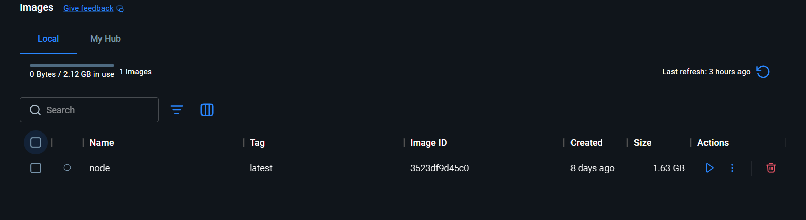

### ⚡ Run node image

```
docker run node
```

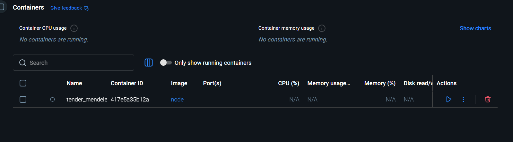

Container created and stopped running

### ⚡ Start the container

```
docker start <container_id>
```

```
docker start 417e5a35b12a3dc620b4532df37aca87004a2acd78d4abcffa9c149738422724
```

Your Docker container is stopping because the main process inside the container is finishing execution. In Docker, a container only runs as long as its main application process is active.

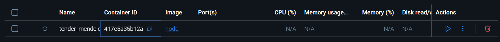

### ⚡ Run node image in interactive mode

```
docker run -it node
```


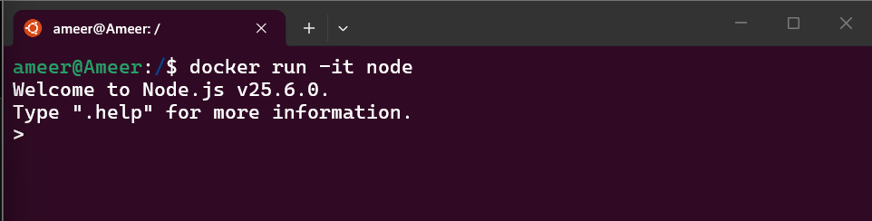

### ⚡Stop Container

```
docker stop <container_id>
```

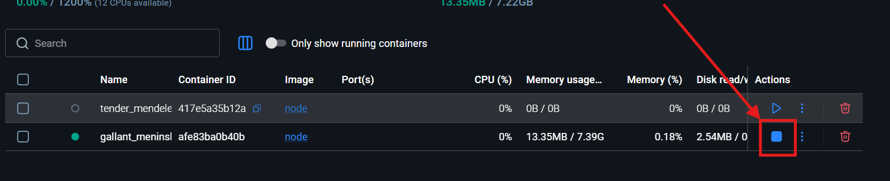

### ⚡ Start container

```
docker start <container_id>
```

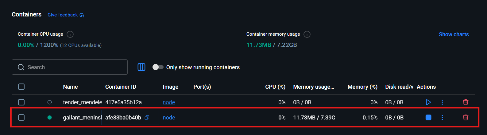

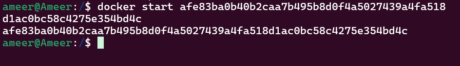

### ⚡ Running commands inside container

```
docker exec -it <container_id> <command>
```

## ✨ Understanding Node Container

```
docker exec -it <container_id> /bin/bash
```


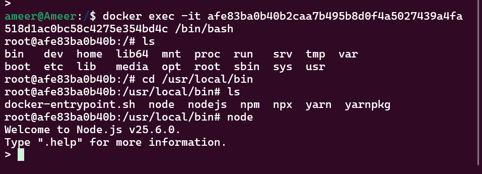

## ✨ Tag Container name

```
docker run --name <container_name> <image_name>
```

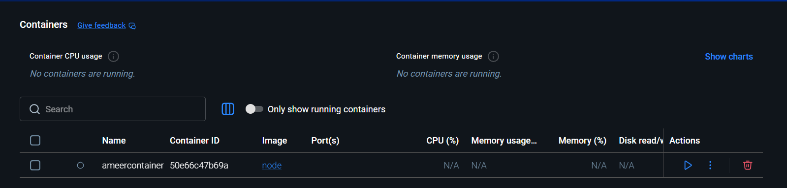

## ✨ Rename Container

```
docker rename <old_name> <new_name>
```

## ✨ Delete Container

```
docker rm <container_id>
```

## ✨ Delete All Stopped Containers

```
docker container prune
```

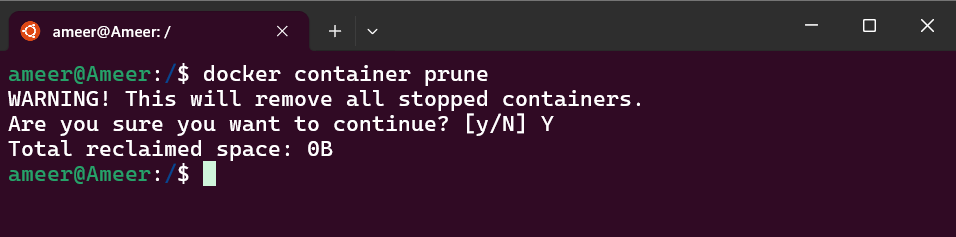

## ✨ Copying files to container

```
docker cp <source> <destination>
```

### ⚡ pull alpine image

```
docker pull alpine
```

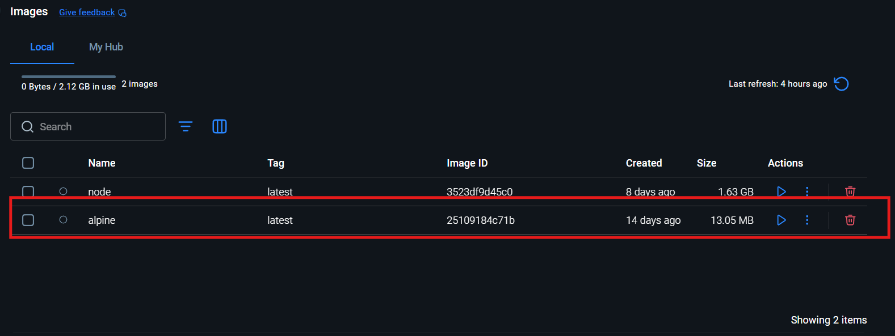

## ⚡ Create a alpine container

```
docker run -it --name alpinecontainer alpine
```

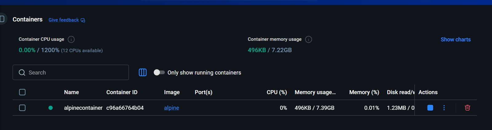

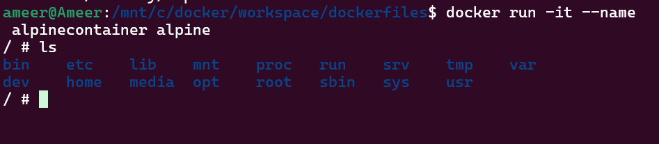

## ⚡ Copy file from container to host

```
docker cp <container_id>:<source> <destination>
```

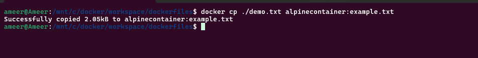
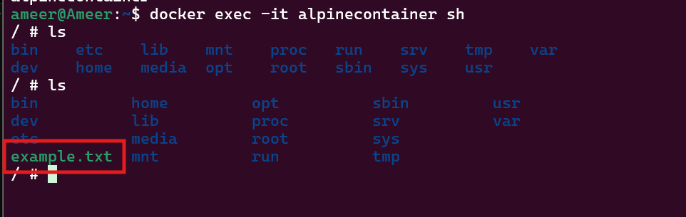
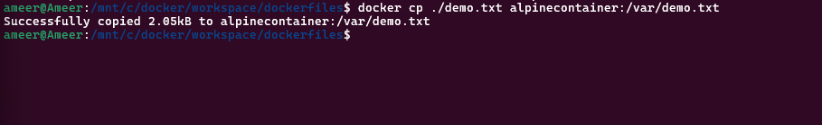

## ✨ copy file from container to local

```
docker cp <container_id>:<source> <destination>
```

```
docker cp alpinecontainer:/example.txt .
```

## ✨ Publishing docker images

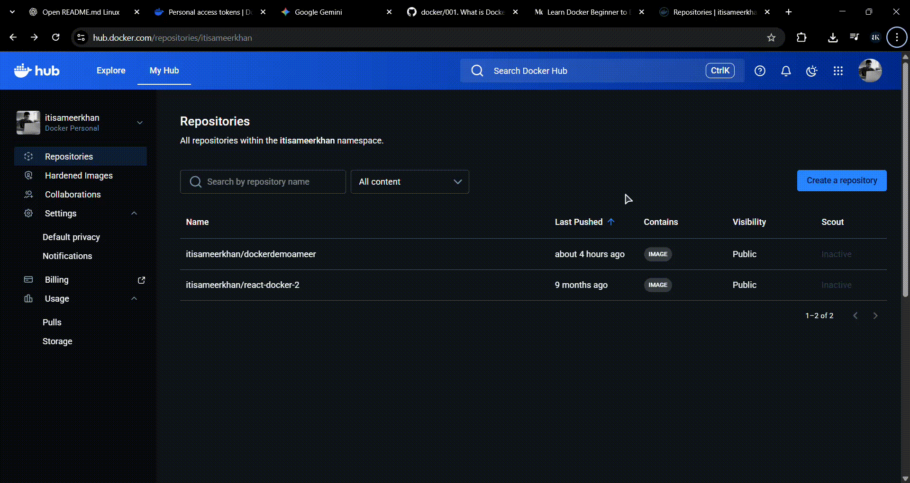

i've created `Dockerfile` in vscode and added this commands

```dockerfile
FROM alpine:latest

CMD echo "Hello, World!"
```

## ✨ Build image

```
docker build -t demodocker .
```

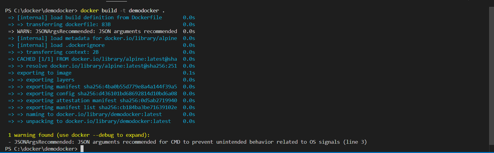
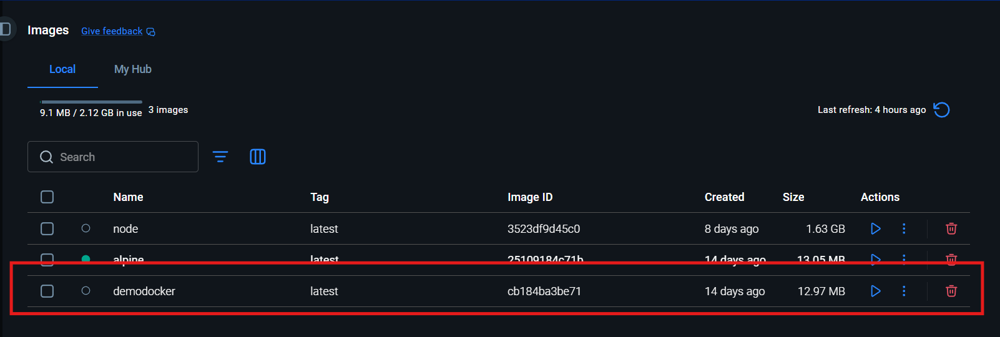

login to docker cli

```
docker login
```

### ✨ Tag image

```
docker tag demodocker <dockerhub_username>/<image_name>:<tag>
```

```
docker tag demodocker itisameerkhan/demodocker:latest
```

### ✨ Push image

```
docker push itisameerkhan/demodocker:latest
```

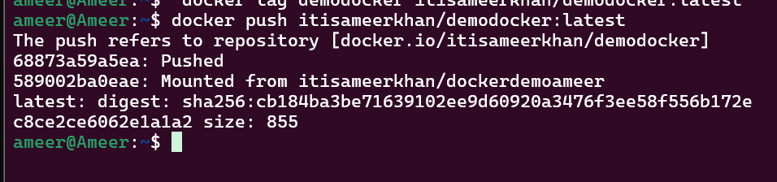
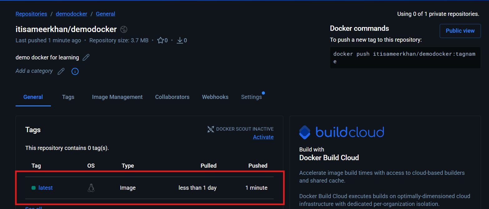

### ✨ Pull image from docker hub

```
docker pull itisameerkhan/demodocker:latest
```

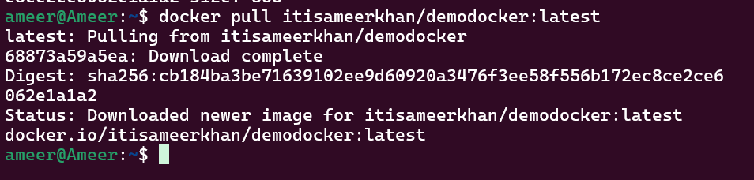
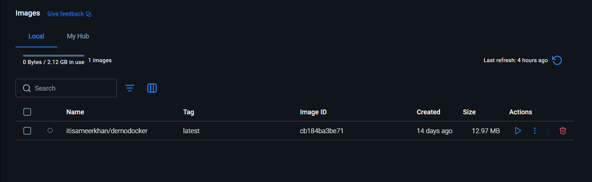
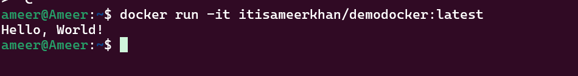
