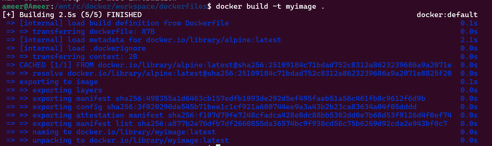
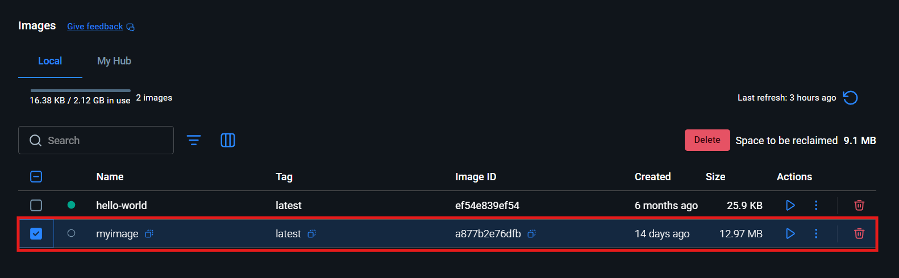
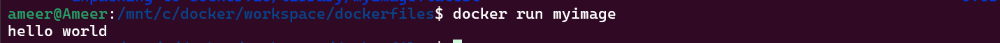
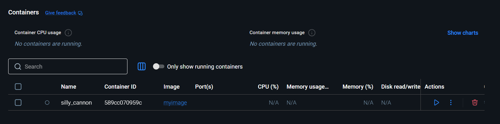

# Dockerfile 


A Dockerfile is a simple text file that contains step-by-step instructions to build a Docker image. It tells Docker what base image to use, what dependencies to install, what files to copy, and how to start the application. You can think of it like a recipe for creating a Docker image. When you run the docker build command, Docker reads the Dockerfile and creates an image based on the instructions inside it.

```dockerfile
FROM alpine:latest

CMD ["echo", "Hello World"]
```

* FROM alpine:latest
Uses Alpine Linux as the base image. Alpine is small, fast, and commonly used for lightweight containers.

* `CMD` ["echo", "Hello World"]
Defines the default command that runs when the container starts.

## ⭐ Build Image

```dockerfile
docker build -t myimage .
```






### ⚡ Run image

```cmd
docker run myimage
```



