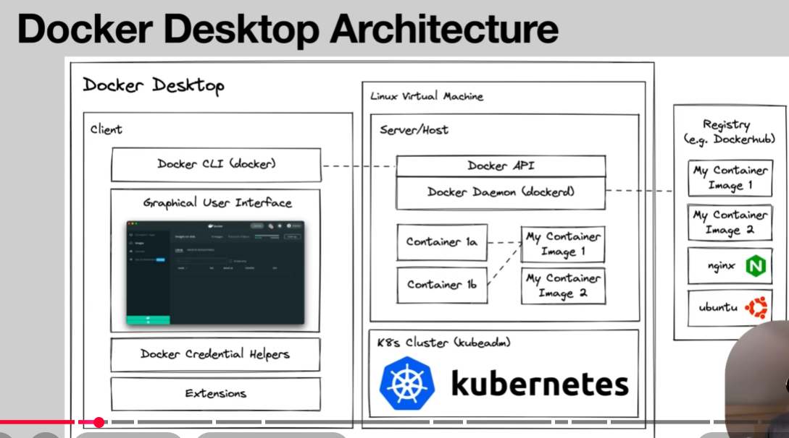

# Linux Building Blocks

## 1. Namespaces (Isolation) 🧩
Namespaces provide **isolation**. They allow processes to have their own view of the system, making them think they are the only ones running on the machine.

*   **PID Namespace**: Isolates Process IDs. A process inside a container can have PID 1, distinct from the host.
*   **NET Namespace**: Isolates network interfaces (IP, ports, routing).
*   **MNT Namespace**: Isolates mount points (filesystems).
*   **UTS Namespace**: Isolates hostname and domain name.
*   **IPC Namespace**: Isolates Inter-Process Communication.
*   **USER Namespace**: Isolates User and Group IDs.

## 2. Control Groups (cgroups) (Resource Management) ⚖️
Control Groups (cgroups) manage **resource limits**. They control how much of the host's resources a container can consume.

*   **Limit Resources**: Restrict CPU usage, Memory (RAM), and Disk I/O.
*   **Prioritization**: Give some containers higher priority for resources than others.
*   **Accounting**: Measure how much resources a container is using.

**Analogy**: If Namespaces are the *walls* of a room (visual isolation), cgroups are the *meter* that limits how much electricity (resources) that room can use.

## 3. Union File System (UnionFS) (Layering) 🍰
UnionFS allows files and directories of separate file systems, known as **branches**, to be transparently overlaid, forming a single coherent file system.

*   **Layered Architecture**: Docker images are made up of multiple read-only layers.
*   **Copy-on-Write (CoW)**: When you modify a file in a container, Docker copies the file from the read-only image layer to the read-write container layer.
*   **Efficiency**: Saves disk space and speeds up container start times because layers are shared.

**Analogy**: Think of it like a stack of transparent overhead projector sheets.
- **Bottom sheets**: The base OS and application code (Read-Only).
- **Top sheet**: Where you draw or make changes (Read-Write).
- You can see through the stack to view the full image, but you only write on the top layer.

## ⭐ Docker Desktop Architecture 

