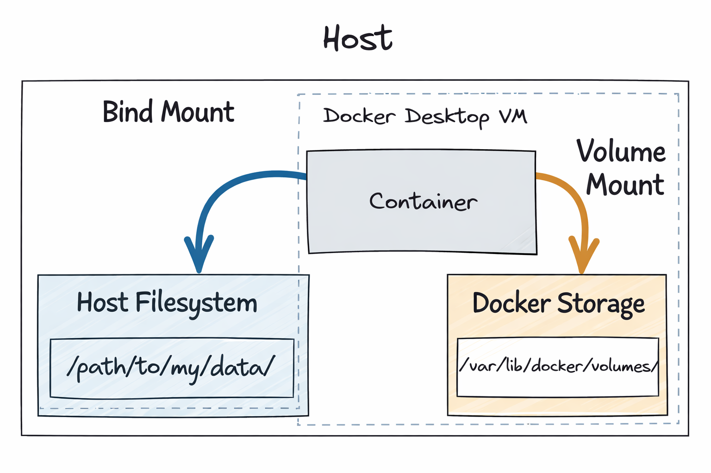

## ⭐ Volume

A Docker volume is a special storage mechanism used to persist data generated by containers. Normally, when a container stops or is deleted, all the data inside it is lost. Volumes solve this problem by storing data outside the container’s writable layer. This allows data to remain safe even if the container is removed or recreated.

### ⚡ Why do we a Volume?

By default, containers are temporary. If you run a database inside a container and then remove the container, all the database data will disappear. Volumes ensure that important data like database files, logs, or uploaded files are stored safely and can be reused.

#### Main Reasons:

* Persist data after container removal

* Share data between containers

* Improve performance compared to bind mounts

* Separate storage from container lifecycle

### ⚡ How Volumes Work ?

Docker stores volumes in a dedicated directory managed by Docker (usually under `/var/lib/docker/volumes`). The container accesses the volume as if it were part of its own file system.

When a container writes data to a mounted volume, the data is stored outside the container.

### ⚡ Create a Volume

```cmd
docker volume create my-volume
```


### ⚡ Mount a Volume

```cmd
docker run -it --mount source=my-volume,destination=/my-data/ ubuntu:22.04

cd /my-data/

echo "hello docker" >> demo.txt
```

### ⚡ Where is this data located?

On linux it would be at `/var/lib/docker/volumes`... but remember, on docker desktop, Docker runs a linux virtual machine.

One way we can view the filesystem of that VM is to use a container image created by `justincormack` that allows us to create a container within the namespace of PID 1. This effectively gives us a container with root access in that VM.

> [!NOTE]
> Generally you should be careful running containers in privileged mode with access to the host system in this way. Only do it if you have a specific reason to do so and you trust the container image.

```bash
# Create a container that can access the Docker Linux VM
# Pinning to the image hash ensures it is this SPECIFIC image
# and not an updated one helps minimize the potential of a supply
# chain attack
docker run -it --rm --privileged --pid=host \
justincormack/nsenter1@sha256:5af0be5e42ebd55eea2c593e4622f810065c3f45bb805eaacf43f08f3d06ffd8

cd /var/lib/docker/volumes

cd my-volume/_data
```

> [!IMPORTANT]
>You cannot mount a volume to an already running container. Docker does NOT allow adding volumes after a container is created.

## ⭐ Bind Mount

A bind mount is a way to connect a folder from your host machine directly into a container. Instead of Docker managing the storage (like volumes), the host’s existing directory is mounted into the container.

**Bind mount = share a real folder from your computer with the container.**

```cmd
docker run -it --rm --mount type=bind,source="${PWD}"/my-data,destination=/my-data ubuntu:22.04

cd my-data

echo "hello from host" >> demo.txt

exit
```

shorter syntax

```cmd
docker run -it --rm -v "${PWD}"/my-data:/my-data ubuntu:22.04
```



## ⚡ Databases

Databases are notoriously fickle to install and configure. The instructions are often complex and vary across different versions and operating systems. For development, where you might need to run multiple versions of a single database or create a fresh database for testing purposes running in a container can be a massive improvement.

The setup/installation is handled by the container image, and all you need to provide is some configuration values. Switching between versions of the database is as easy as specifying a different image tag (e.g. `postgres:14.6` vs `postgres:15.1`).

A few key considerations when running databases in containers:

* **Use volume(s) to persist data:** The entire reason for section above was to give you an understanding of how to avoid data loss. Generally databases will store its data at one or more known paths. You should identify those and mount volumes to those locations in the containers to ensure data persists beyond the container.
* **Use bind mount(s) for additional config:** Often databases use configuration files to influence runtime behavior. You can create these files on your host system, and then use a bind mount to place them in the correct location within the container to be read upon startup.
* **Set environment variables:** In addition to configuration files many databases use environment variables to influence runtime behavior (for example setting the admin password). Identify these variables and set the accordingly.

Here are some useful databases container images and sample commands that attempt to mount the necessary data directories into volumes and set key environment variables.

### ⚡ Postgres

```bash
docker run -d --rm \
-v pgdata:/var/lib/postgresql/data \
-e POSTGRES_PASSWORD=foobarbaz \
-p 5432:5432 \
postgres:15.1-alpine

# With custom postresql.conf file
docker run -d --rm \
-v pgdata:/var/lib/postgresql/data \
-v ${PWD}/postgres.conf:/etc/postgresql/postgresql.conf \
-e POSTGRES_PASSWORD=foobarbaz \
-p 5432:5432 \
postgres:15.1-alpine -c 'config_file=/etc/postgresql/postgresql.conf'
```

### ⚡ Mongo

```bash
docker run -d --rm \
-v mongodata:/data/db \
-e MONGO_INITDB_ROOT_USERNAME=root \
-e MONGO_INITDB_ROOT_PASSWORD=foobarbaz \
-p 27017:27017 \
mongo:6.0.4

# With custom mongod.conf file
docker run -d --rm \
-v mongodata:/data/db \
-v ${PWD}/mongod.conf:/etc/mongod.conf \
-e MONGO_INITDB_ROOT_USERNAME=root \
-e MONGO_INITDB_ROOT_PASSWORD=foobarbaz \
-p 27017:27017 \
mongo:6.0.4 --config /etc/mongod.conf
```

### ⚡ Redis

[redis](https://hub.docker.com/_/redis)

Depending how you are using redis within your application, you may or may not care if the data is persisted.

```bash
docker run -d --rm \
-v redisdata:/data \
redis:7.0.8-alpine

# With custom redis.conf file
docker run -d --rm \
-v redisdata:/data \
-v ${PWD}/redis.conf:/usr/local/etc/redis/redis.conf \
redis:7.0.8-alpine redis-server /usr/local/etc/redis/redis.conf
```

### ⚡ MySQL

[mysql](https://hub.docker.com/_/mysql)

```bash
docker run -d --rm \
-v mysqldata:/var/lib/mysql \
-e MYSQL_ROOT_PASSWORD=foobarbaz \
-p 3306:3306 \
mysql:8.0.32

# With custom conf.d
docker run -d --rm \
-v mysqldata:/var/lib/mysql \
-v ${PWD}/conf.d:/etc/mysql/conf.d \
-e MYSQL_ROOT_PASSWORD=foobarbaz \
-p 3306:3306 \
mysql:8.0.32
```

### ⚡ Elasticsearch

[elasticsearch](https://hub.docker.com/_/elasticsearch)

```bash
docker run -d --rm \
-v elasticsearchdata:/usr/share/elasticsearch/data \
-e ELASTIC_PASSWORD=foobarbaz \
-e "discovery.type=single-node" \
-p 9200:9200 \
-p 9300:9300 \
elasticsearch:8.6.0
```

### ⚡ Neo4j

[neo4j](https://hub.docker.com/_/neo4j)

```bash
docker run -d --rm \
-v neo4jdata:/data \
-e NEO4J_AUTH=neo4j/foobarbaz \
-p 7474:7474 \
-p 7687:7687 \
neo4j:5.4.0-community
```

## ⭐ Interactive Test Environment

### ⚡ Operating Systems
```cmd
# https://hub.docker.com/_/ubuntu
docker run -it --rm ubuntu:22.04

# https://hub.docker.com/_/debian
docker run -it --rm debian:bullseye-slim

# https://hub.docker.com/_/alpine
docker run -it --rm alpine:3.17.1

# https://hub.docker.com/_/busybox
docker run -it --rm busybox:1.36.0 # small image with lots of useful utilities
```

### ⚡ Programming runtimes

```cmd
# https://hub.docker.com/_/python
docker run -it --rm python:3.11.1

# https://hub.docker.com/_/node
docker run -it --rm node:18.13.0

# https://hub.docker.com/_/php
docker run -it --rm php:8.1

# https://hub.docker.com/_/ruby
docker run -it --rm ruby:alpine3.17
```

## ⭐ CLI Utilities

Sometimes you don't have a particular utility installed on your current system, or breaking changes between versions make it handy to be able to run a specific version of a utility inside of a container without having to install anything on the host!

### ⚡ jq (json command line utility)

https://hub.docker.com/r/stedolan/jq

```bash
docker run -i stedolan/jq <sample-data/test.json '.key_1 + .key_2'
```

### ⚡ yq (yaml command line utility)

https://hub.docker.com/r/mikefarah/yq

```bash
docker run -i mikefarah/yq <sample-data/test.yaml '.key_1 + .key_2'
```

### ⚡ sed

GNU sed behaves differently from the default MacOS version for certain edge cases.

```bash
docker run -i --rm busybox:1.36.0 sed 's/file./file!/g' <sample-data/test.txt
```

### ⚡ base64

GNU base64 behaves differently from the default MacOS version for certain edge cases.

```bash
# Pipe input from previous command
echo "This string is just long enough to trigger a line break in GNU base64." | docker run -i --rm busybox:1.36.0 base64

# Read input from file
docker run -i --rm busybox:1.36.0 base64 </sample-data/test.txt
```

### ⚡ Amazon Web Services CLI

https://hub.docker.com/r/amazon/aws-cli

```bash
# Bind mount the credentials into the container
docker run --rm -v ~/.aws:/root/.aws amazon/aws-cli:2.9.18 s3 ls
```

### ⚡ Google Cloud Platform CLI

```bash
# Bind mount the credentials into the container
docker run --rm -v ~/.config/gcloud:/root/.config/gcloud gcr.io/google.com/cloudsdktool/google-cloud-cli:415.0.0 gsutil ls
# Why is the container image so big 😭?! 2.8GB
```