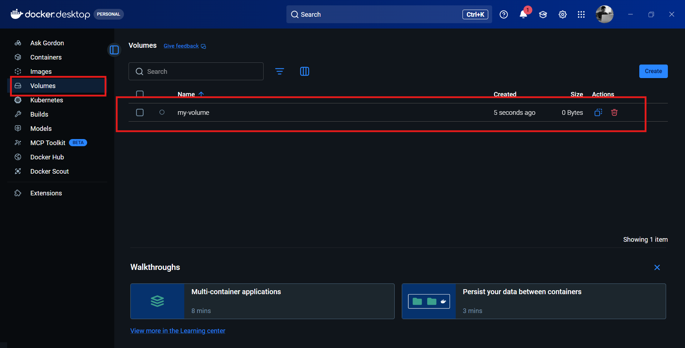

## ⭐ Volume

A Docker volume is a special storage mechanism used to persist data generated by containers. Normally, when a container stops or is deleted, all the data inside it is lost. Volumes solve this problem by storing data outside the container’s writable layer. This allows data to remain safe even if the container is removed or recreated.

### ⚡ Why do we a Volume?

By default, containers are temporary. If you run a database inside a container and then remove the container, all the database data will disappear. Volumes ensure that important data like database files, logs, or uploaded files are stored safely and can be reused.

#### Main Reasons:

* Persist data after container removal

* Share data between containers

* Improve performance compared to bind mounts

* Separate storage from container lifecycle

### ⚡ How Volumes Work ?

Docker stores volumes in a dedicated directory managed by Docker (usually under `/var/lib/docker/volumes`). The container accesses the volume as if it were part of its own file system.

When a container writes data to a mounted volume, the data is stored outside the container.

### ⚡ Create a Volume

```cmd
docker volume create my-volume
```



### ⚡ Mount a Volume

```cmd
docker run -it --mount source=my-volume,destination=/my-data/ ubuntu:22.04

cd /my-data/

echo "hello docker" >> demo.txt
```

### ⚡ Where is this data located?

On linux it would be at `/var/lib/docker/volumes`... but remember, on docker desktop, Docker runs a linux virtual machine.

One way we can view the filesystem of that VM is to use a container image created by `justincormack` that allows us to create a container within the namespace of PID 1. This effectively gives us a container with root access in that VM.

> [!NOTE]
> Generally you should be careful running containers in privileged mode with access to the host system in this way. Only do it if you have a specific reason to do so and you trust the container image.

```bash
# Create a container that can access the Docker Linux VM
# Pinning to the image hash ensures it is this SPECIFIC image
# and not an updated one helps minimize the potential of a supply
# chain attack
docker run -it --rm --privileged --pid=host \
justincormack/nsenter1@sha256:5af0be5e42ebd55eea2c593e4622f810065c3f45bb805eaacf43f08f3d06ffd8

cd /var/lib/docker/volumes

cd my-volume/_data
```

> [!IMPORTANT]
>You cannot mount a volume to an already running container. Docker does NOT allow adding volumes after a container is created.
