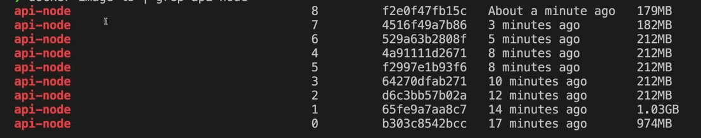

# Building Container Image

## ⭐ Building Image for Nodejs 

```Dockerfile
#Dockerfile

FROM ubuntu

RUN apt update

RUN apt install nodejs -y
```

```cmd
# vs code terminal
docker build .
```


```Dockerfile
#Dockerfile

FROM ubuntu

RUN apt update && RUN apt install nodejs -y
```

This Dockerfile is used to create a Docker image with Ubuntu and Node.js installed.

In simple words, it tells Docker:
“Start with Ubuntu, update it, and install Node.js.”

### Code

```Dockerfile
FROM ubuntu
RUN apt update && apt install nodejs -y
```

### Simple Explanation

* **FROM ubuntu**
  Uses Ubuntu as the base operating system.

* **RUN apt update**
  Updates the package list inside Ubuntu.

* **apt install nodejs -y**
  Installs Node.js.
  `-y` means automatically say "yes" to installation prompts.

---

### Quick Table

| Line                  | Meaning             |
| --------------------- | ------------------- |
| FROM ubuntu           | Use Ubuntu OS       |
| apt update            | Update package list |
| apt install nodejs -y | Install Node.js     |


```Dockerfile
FROM ubuntu

RUN apt update 

RUN apt install nodejs npm -y    

COPY . . 

RUN npm install

CMD ["npm", "run", "dev"]
```

```cmd
#vs code terminal

docker build -t api-node:0 .
```


* **`FROM ubuntu`**
  ➝ Uses Ubuntu as the base operating system for the container.

* **`RUN apt update`**
  ➝ Updates the Ubuntu package list so software can be installed.

* **`RUN apt install nodejs npm -y`**
  ➝ Installs Node.js and npm.
  ➝ `-y` automatically confirms installation.

* **`COPY . .`**
  ➝ Copies all files from your current project folder into the container.

* **`RUN npm install`**
  ➝ Installs project dependencies from `package.json`.

* **`CMD ["npm", "run", "dev"]`**
  ➝ Starts the application using the `dev` script when the container runs.


This Dockerfile creates a container using the official Node image, copies your project files, installs dependencies, and starts the app.

---

```Dockerfile
FROM node

COPY . . 

RUN npm install

CMD ["npm", "run", "dev"]
```

* **`FROM node`**
  ➝ Uses the official Node.js image as the base.
  ➝ Node and npm are already installed (no need to install manually).

* **`COPY . .`**
  ➝ Copies all project files from your system into the container.

* **`RUN npm install`**
  ➝ Installs dependencies from `package.json`.

* **`CMD ["npm", "run", "dev"]`**
  ➝ Runs your app using the `dev` script when the container starts.

---

### Quick Table

| Instruction               | Purpose                            |
| ------------------------- | ---------------------------------- |
| FROM node                 | Base image with Node pre-installed |
| COPY . .                  | Copy project files                 |
| RUN npm install           | Install dependencies               |
| CMD ["npm", "run", "dev"] | Start the application              |

---


```Dockerfile
FROM node:19.6-alpine

COPY . . 

RUN npm install

CMD ["npm", "run", "dev"]
```

* **`FROM node:19.6-alpine`**
➝ Uses Node.js version 19.6 with Alpine Linux.
➝ Alpine is very small and lightweight, so the image size is smaller.


| Base Image       | OS Type      | Node Installed? | Size (Your Build) | Recommendation  |
| ---------------- | ------------ | --------------- | ----------------- | --------------- |
| ubuntu           | Full Ubuntu  | ❌ No            | 1.53 GB           | Not recommended |
| node             | Debian-based | ✅ Yes           | 1.64 GB           | Okay            |
| node:19.6-alpine | Alpine Linux | ✅ Yes           | 270 MB            | ✅ Best          |


```Dockerfile
FROM node:19.6-alpine

COPY package*.json ./

RUN npm install

COPY . . 

CMD ["npm", "run", "dev"]
```

In the old version, you copied the entire project first, then ran npm install.

In the new version, you copy only package.json files first, run npm install, and then copy the remaining project files.

This change improves Docker build speed using caching.

| Feature                            | Old Version | New Version |
| ---------------------------------- | ----------- | ----------- |
| Copies everything first            | ✅ Yes       | ❌ No        |
| Copies package files separately    | ❌ No        | ✅ Yes       |
| Optimized build speed              | ❌ No        | ✅ Yes       |
| Re-runs npm install on code change | ✅ Yes       | ❌ No        |

```Dockerfile
FROM node:19.6-alpine

WORKDIR /user/src/app

COPY package*.json ./

RUN npm install

COPY . . 

CMD ["npm", "run", "dev"]
```

* **`WORKDIR /user/src/app`**

➝ Sets this folder as the working directory inside the container.

➝ All next commands run inside this folder.

### ✨ .dockerignore

### What is `.dockerignore`?

`.dockerignore` is a file used to tell Docker **which files or folders NOT to copy** into the Docker image during `COPY . .`.

It works like `.gitignore`, but for Docker builds.

When you run `docker build`, Docker sends your project folder to the Docker daemon. `.dockerignore` helps reduce that size by ignoring unnecessary files.

---

### Example `.dockerignore`

```bash
node_modules
.git
.env
Dockerfile
.dockerignore
```

```Dockerfile
FROM node:19.6-alpine

WORKDIR /user/src/app

COPY package*.json ./

RUN npm install

USER node

COPY --chown=node:node . . 

CMD ["npm", "run", "dev"]
```

In your Dockerfile, the container normally runs as **root**, which means admin-level access. When you add `USER node`, you are telling Docker to stop running the container as root and instead run it as the `node` user. This is mainly done for security reasons. Running applications as root is risky because if something goes wrong or your app is compromised, it can affect the whole container system. The official `node:19.6-alpine` image already has a built-in user called `node`, so you are simply switching to that safer user.

When you write `COPY --chown=node:node . .`, you are copying your project files into the container and at the same time changing their ownership. By default, copied files belong to root. But since your container is now running as the `node` user, that user must have permission to access and modify those files. The `node:node` format means user `node` and group `node`. This prevents permission errors and ensures the application runs smoothly.

**Key Points:**

* By default, Docker runs as root (admin).

* `USER node` switches the container to a normal user for better security.
* `--chown=node:node` makes the node user the owner of copied files.
* Without `--chown`, files stay owned by root and may cause permission issues.
* The `node` user already exists in the official Node image.

```Dockerfile
FROM node:19.6-alpine

WORKDIR /user/src/app

ENV NODE_ENV production

COPY package*.json ./

RUN npm install

USER node

COPY --chown=node:node . . 

CMD ["npm", "run", "dev"]
```

In this Dockerfile, the line `ENV NODE_ENV production` is used to set an **environment variable** inside the container. An environment variable is simply a configuration value that your application can read while running. Here, you are telling the container that the application is running in **production mode**. Many Node.js applications behave differently based on the value of `NODE_ENV`. For example, when it is set to `production`, some frameworks disable debugging, improve performance, and install only required dependencies.

When Docker builds the image, this variable becomes part of the container environment. Inside your Node.js app, you can access it using `process.env.NODE_ENV`. Since you set it to `production`, the app will know it is running in a production environment.


**Key Points:**

* `ENV` sets environment variables inside the container.

* `NODE_ENV=production` tells Node.js the app is running in production mode.
* Apps can read it using `process.env.NODE_ENV`.
* Production mode improves performance and disables debug features.
* Running `npm run dev` with `NODE_ENV=production` is usually not recommended.

```Dockerfile
FROM node:19.6-alpine

WORKDIR /user/src/app

ENV NODE_ENV production

COPY package*.json ./

RUN npm ci --only=production

USER node

COPY --chown=node:node . . 

CMD ["npm", "run", "dev"]
```

In this Dockerfile, the important change is:

```dockerfile
RUN npm ci --only=production
```

`npm ci` means **clean install**. It installs dependencies exactly as written in `package-lock.json`. It is mainly used in production and CI/CD pipelines because it is faster and more reliable than `npm install`. It deletes any existing `node_modules` folder and installs fresh dependencies strictly based on the lock file. This ensures consistent builds every time.

The option `--only=production` tells npm to install only production dependencies and skip devDependencies. Since you already set:

---

```Dockerfile
FROM node:19.6-alpine

WORKDIR /user/src/app

ENV NODE_ENV production

COPY package*.json ./

RUN npm ci --only=production

USER node

COPY --chown=node:node . . 

EXPOSE 8080

CMD ["node", "index.js"]
```

In your Dockerfile, the line `EXPOSE 8080` is used to tell Docker that the application inside the container will run on port **8080**. It is mainly a documentation instruction. It does not actually open the port automatically; it just informs Docker and other developers which port the container uses.

For example, if your `index.js` server is listening like this:

```js
app.listen(8080);
```

then `EXPOSE 8080` makes it clear that port 8080 is the intended network port for this container.

To actually access the app from your machine, you still need to publish the port when running the container:

```bash
docker run -p 8080:8080 image-name
```

This maps:

* Left 8080 → your local machine
* Right 8080 → container port

So `EXPOSE 8080` is just metadata, while `-p` in `docker run` actually connects the port.

**Key Points:**

* `EXPOSE 8080` tells Docker the container uses port 8080.
* It does NOT automatically make it accessible.
* You must use `-p` to map the port.
* It helps documentation and container networking.
* Should match the port your app is listening on.

In one simple line:

`EXPOSE 8080` = “My app runs on port 8080 inside the container.”

---

```Dockerfile
FROM node:19.6-alpine

WORKDIR /user/src/app

ENV NODE_ENV production

COPY package*.json ./

RUN --mount=type=cache,target=/usr/src/app/.npm \
    npm set cache /usr/src/app/.npm && \
    npm ci --only=production

USER node

COPY --chown=node:node . . 

EXPOSE 8080

CMD ["node", "index.js"]
```

This line is using **Docker build cache optimization** to make `npm install` faster during rebuilds.

The command:

```
RUN --mount=type=cache,target=/usr/src/app/.npm \
    npm set cache /usr/src/app/.npm && \
    npm ci --only=production
```

is mainly about caching npm packages during Docker build.

---

### What It Means in Simple Paragraph

Normally, every time Docker rebuilds the image, `npm ci` downloads all packages again from the internet. That is slow. Here, `--mount=type=cache` creates a temporary cache folder that Docker can reuse between builds. So instead of downloading everything again, npm uses the cached packages. This makes builds much faster, especially in CI/CD pipelines.

---

### Line-by-Line Meaning

* `--mount=type=cache,target=/usr/src/app/.npm`
  Creates a build cache folder at `/usr/src/app/.npm`.
  Docker reuses this cache in future builds.


* `npm set cache /usr/src/app/.npm`
  Tells npm to store downloaded packages in that cache folder.

* `npm ci --only=production`
  Installs production dependencies using the cached packages.

---




---

## Additional Features

* **Parser directives**
  ➝ Special instructions at the very top of a Dockerfile (like `# syntax=...`) that tell Docker how to read or process the file.

* **ARG**
  ➝ Defines build-time variables. You can pass them using `docker build --build-arg`, but they do not exist when the container is actually running.

* **LABEL**
  ➝ Adds metadata (like version, author, or description) to your Docker image using key-value pairs.

* **Heredocs syntax**
  ➝ Allows you to write cleaner multi-line scripts or commands inside a `RUN` instruction without chaining them with `&& \`. For example, using `<<EOF`.

* **Mounting secrets**
  ➝ A secure way to use passwords or API keys during the build process (`RUN --mount=type=secret...`) without storing or exposing them in the final Docker image.

* **ENTRYPOINT + CMD**
  ➝ `ENTRYPOINT` defines the main command that always runs, while `CMD` provides default arguments for it. Together, they make your container act like a flexible executable program.

* **ADD vs COPY**
  ➝ Both copy files into your image. 
  ➝ Use `COPY` for normal local files. 
  ➝ Use `ADD` only if you need to download from a URL or automatically unpack a compressed `.tar` archive. `COPY` is generally preferred for simplicity and transparency.

* **buildx (multi-architecture images)**
  ➝ A Docker CLI plugin (`docker buildx build`) that lets you build images for multiple CPU architectures (like both Intel/AMD and Apple Silicon ARM) at the same time.

```Dockerfile
# syntax=docker/dockerfile:1.5
# escape=\
# ^ OPTIONAL "directives" (must be at top if used)

# THIS IS A COMMENT

# ARG is the only instruction that can come before FROM 
ARG BASE_IMAGE_TAG=19.4
# ARGs can be overriden at build time 
# > docker build --build-arg BASE_VERSION=19.3 .

FROM node:${BASE_IMAGE_TAG}

LABEL org.opencontainers.image.authors="sid@devopsdirective.com"

RUN echo "Hey Team 👋 (shell form)"
RUN ["echo", "Hey Team 👋 (exec form)"]

# Heredocs allow for specifying multiple commands to 
# be run within a single step, across multiple lines
# without lots of && and \
RUN <<EOF
apt update
apt install iputils-ping -y
EOF

# --mount allows for mounting additional files
# into the build context
# RUN --mount=type=bind ...
# RUN --mount=type=cache ...
# RUN --mount=type=ssh ...
RUN --mount=type=secret,id=secret.txt,dst=/container-secret.txt \
  echo "Run the command that requires access to the secret here"

# Available only at build time
# (Still in image metadata though...)
ARG BUILD_ARG=foo

# Available at build and run time
ENV ENV_VAR=bar

# Set the default working directory 
# Use the convention of your language/framework 
WORKDIR path/to/the/working/directory

ENTRYPOINT [ "echo", "Hey Team 👋 (entrypoint)" ]
CMD [ "+ (cmd)" ]
```