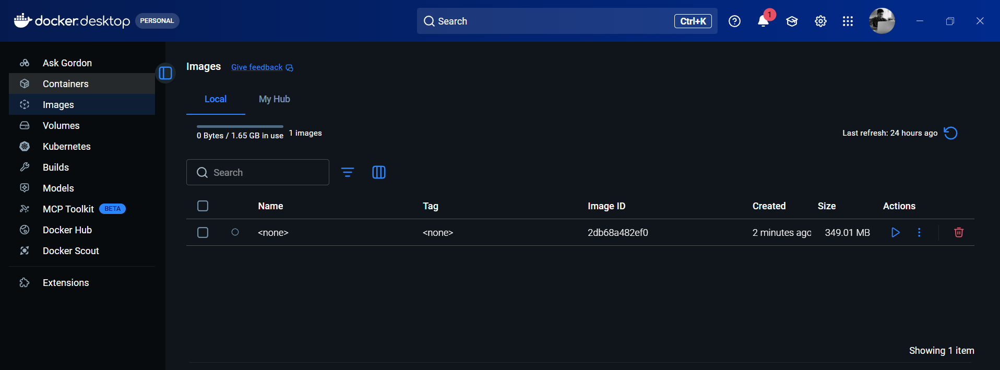
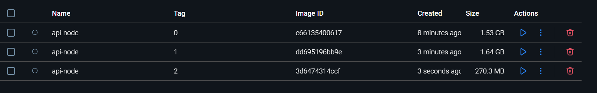

# Building Container Image

## ⭐ Building Image for Nodejs 

```Dockerfile
#Dockerfile

FROM ubuntu

RUN apt update

RUN apt install nodejs -y
```

```cmd
# vs code terminal
docker build .
```


```Dockerfile
#Dockerfile

FROM ubuntu

RUN apt update && RUN apt install nodejs -y
```

This Dockerfile is used to create a Docker image with Ubuntu and Node.js installed.

In simple words, it tells Docker:
“Start with Ubuntu, update it, and install Node.js.”

### Code

```Dockerfile
FROM ubuntu
RUN apt update && apt install nodejs -y
```

### Simple Explanation

* **FROM ubuntu**
  Uses Ubuntu as the base operating system.

* **RUN apt update**
  Updates the package list inside Ubuntu.

* **apt install nodejs -y**
  Installs Node.js.
  `-y` means automatically say "yes" to installation prompts.

---

### Quick Table

| Line                  | Meaning             |
| --------------------- | ------------------- |
| FROM ubuntu           | Use Ubuntu OS       |
| apt update            | Update package list |
| apt install nodejs -y | Install Node.js     |


```Dockerfile
FROM ubuntu

RUN apt update 

RUN apt install nodejs npm -y    

COPY . . 

RUN npm install

CMD ["npm", "run", "dev"]
```

```cmd
#vs code terminal

docker build -t api-node:0 .
```


* **`FROM ubuntu`**
  ➝ Uses Ubuntu as the base operating system for the container.

* **`RUN apt update`**
  ➝ Updates the Ubuntu package list so software can be installed.

* **`RUN apt install nodejs npm -y`**
  ➝ Installs Node.js and npm.
  ➝ `-y` automatically confirms installation.

* **`COPY . .`**
  ➝ Copies all files from your current project folder into the container.

* **`RUN npm install`**
  ➝ Installs project dependencies from `package.json`.

* **`CMD ["npm", "run", "dev"]`**
  ➝ Starts the application using the `dev` script when the container runs.


This Dockerfile creates a container using the official Node image, copies your project files, installs dependencies, and starts the app.

---

```Dockerfile
FROM node

COPY . . 

RUN npm install

CMD ["npm", "run", "dev"]
```

* **`FROM node`**
  ➝ Uses the official Node.js image as the base.
  ➝ Node and npm are already installed (no need to install manually).

* **`COPY . .`**
  ➝ Copies all project files from your system into the container.

* **`RUN npm install`**
  ➝ Installs dependencies from `package.json`.

* **`CMD ["npm", "run", "dev"]`**
  ➝ Runs your app using the `dev` script when the container starts.

---

### Quick Table

| Instruction               | Purpose                            |
| ------------------------- | ---------------------------------- |
| FROM node                 | Base image with Node pre-installed |
| COPY . .                  | Copy project files                 |
| RUN npm install           | Install dependencies               |
| CMD ["npm", "run", "dev"] | Start the application              |

---


```Dockerfile
FROM node:19.6-alpine

COPY . . 

RUN npm install

CMD ["npm", "run", "dev"]
```

* **`FROM node:19.6-alpine`**
➝ Uses Node.js version 19.6 with Alpine Linux.
➝ Alpine is very small and lightweight, so the image size is smaller.



| Base Image       | OS Type      | Node Installed? | Size (Your Build) | Recommendation  |
| ---------------- | ------------ | --------------- | ----------------- | --------------- |
| ubuntu           | Full Ubuntu  | ❌ No            | 1.53 GB           | Not recommended |
| node             | Debian-based | ✅ Yes           | 1.64 GB           | Okay            |
| node:19.6-alpine | Alpine Linux | ✅ Yes           | 270 MB            | ✅ Best          |
