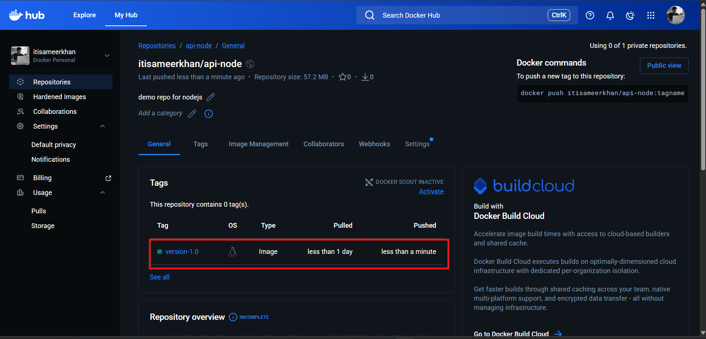

## container registeries


Docker container registries are centralized storage systems where Docker images are stored, managed, and shared. When you build a Docker image of your application (for example, a Node.js app), that image needs to be stored somewhere so it can be pulled and used on another machine, server, or cloud platform. A Docker registry acts like a GitHub for Docker images — you push images to it and pull images from it whenever required. Registries can be public (anyone can access) or private (restricted access for security and enterprise use).

**Key Points:**

* Used to **store and distribute Docker images**

* Supports **push (upload)** and **pull (download)** operations
* Can be **public or private**
* Enables **CI/CD and cloud deployments**
* Helps with **version control using image tags**

**Common Docker Registries:**

| Registry Name                     | Type    | Used For                | Example Use Case                 |
| --------------------------------- | ------- | ----------------------- | -------------------------------- |
| Docker Hub                        | Public  | Default Docker registry | Sharing public images like nginx |
| Amazon Elastic Container Registry | Private | AWS cloud deployments   | Store images for ECS/EKS         |
| Google Container Registry         | Private | GCP deployments         | Store images for GKE             |
| Azure Container Registry          | Private | Azure deployments       | Store images for AKS             |

**Basic Flow:**

1. Build image → `docker build`

2. Login → `docker login`

3. Tag image → `docker tag`

4. Push to registry → `docker push`

5. Pull from registry → `docker pull`

---

## ⭐ Creating a Container Registeries


### ⚡ **Step-by-Step Process (Docker Hub Example)**

1. **Create Repository**

   * Go to Docker Hub

   * Click **Create Repository**
   * Give name (example: `api-node`)
   * Choose Public or Private


2. **Build Your Docker Image (Local)**

```bash
docker build -t api-node .
```

3. **Login (Authentication)**

```bash
docker login
```

Enter Docker Hub username
Enter password or access token

4. **Tag the Image (Very Important)** Format:

```bash
docker tag <local-image> <dockerhub-username>/<repo-name>:<version>
```

Example:

```bash
docker tag api-node itisameerkhan/api-node:version-1.0
```

This tells Docker where the image should be pushed.

5. **Push Image to Registry**

```bash
docker push itisameerkhan/api-node:version-1.0
```

6. **Verify**

Refresh Docker Hub

You will see image with tag `version-1.0`


---

## ⭐ Tagging Images

* Images can have multiple tags. The following all point to a single image (on 2023-01-30):
  * *ubuntu:latest*
  * *ubuntu:22.04*
  * *ubuntu:jammy-20221130*
  * *ubuntu:jammy*
  * *ubuntu@sha256:27cb6e6ccef575a4698b66f5de06c7ecd61589132d5a91d098f7f3f9285415a9*

* Any tag except for temporary ones used during development should be treated as **immutable**

* Automated builds should use some combination of:
  * Timestamp when image was built
  * Build ID (from continuous integration system)
  * Commit hash of code used to build image
  * SemVer release version

* If using any registry other than DockerHub, the registry host should prefix the image name, e.g.: **ghcr.io/sidpalas/my-image:image-tag**
