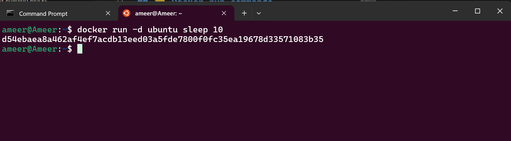
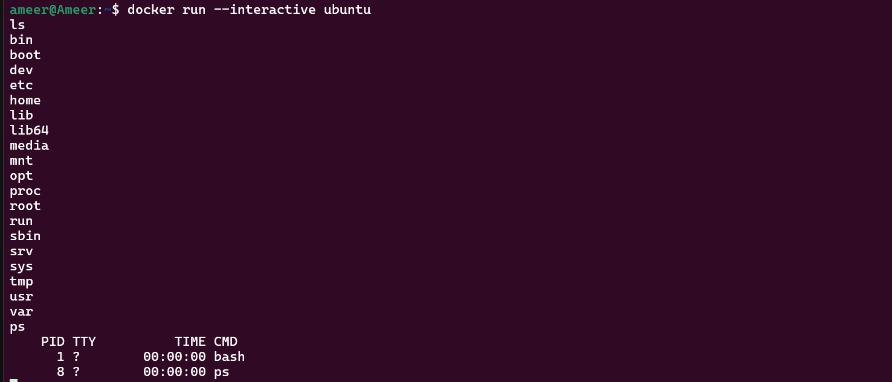
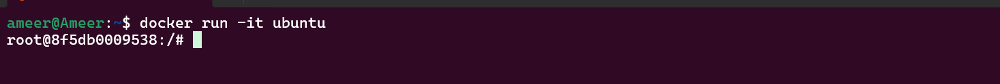
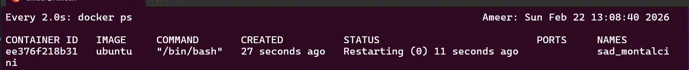
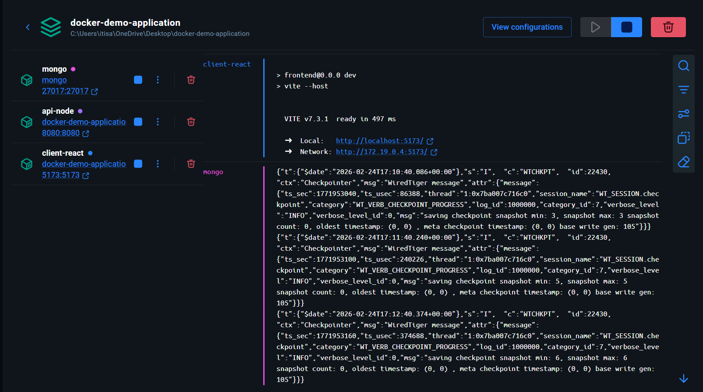

# Running Containers

## ⭐ `docker run` and `docker compose`

`docker run` and `docker compose` are both used to start containers, but they serve different levels of application complexity. `docker run` is a simple command used to create and start a single container directly from the terminal. You pass everything (ports, volumes, environment variables, network) manually in the command. It is good for small tasks, testing, or running one service.

`docker compose` is used when your application has multiple containers that need to work together. Instead of writing long commands, you define everything inside a `docker-compose.yml` file and start the whole application with one command. It is structured, reusable, and much better for real-world projects like MERN stack (React + Node + MongoDB).

Here is a clean comparison:

| Feature             | docker run               | docker compose                              |
| ------------------- | ------------------------ | ------------------------------------------- |
| Usage               | Runs one container       | Runs multiple containers together           |
| Configuration       | Command line arguments   | YAML file (docker-compose.yml)              |
| Best for            | Simple or single service | Full applications (frontend + backend + DB) |
| Network setup       | Manual                   | Automatic                                   |
| Reusability         | Low                      | High                                        |
| Maintainability     | Hard for big apps        | Easy and organized                          |
| Real-world projects | Not ideal                | Recommended                                 |

## ⭐ Docker run commands

* `-d`

* `--entrypoint`

* `--env`, `-e`, `--env-file`

* `--init`

* `--interactive`, `-i`, `--tty`, `-t`

* `--mount`, `--volume`, `-v`

* `--name`

* `--network`, `--net`

* `--platform`

* `--publish`, `-p`

* `--restart`

* `--rm`

---

### ⚡ `-d` (detached mode)

* Runs container in background

* No need to keep terminal open
* Container keeps running even after you close terminal

```cmd
docker run ubuntu sleep 5
```


```cmd
docker run -d ubuntu sleep 5
```



* Here the Terminal is free to use because the container is running in background

* After 10 seconds the container will stop

---

### ⚡ `--entrypoint`

```cmd
docker run --entrypoint echo ubuntu hello
```

#### output

```
hello
```

* `docker run` → Start a new container

* `ubuntu` → Use the Ubuntu image

* `--entrypoint echo` → Override the default entrypoint and force it to run echo

* `hello` → Argument passed to echo

---

### ⚡ `--env`, `-e`, `--env-file`

```cmd
docker run --env MY_ENV=ameer ubuntu printenv  
```


* `--env MY_ENV=ameer` → Create an environment variable inside the container

* `printenv` → Command that prints all environment variables

---

### ⚡ `--init`

```cmd
docker run ubuntu ps
```

#### output

```cmd
PID TTY    TIME CMD
1 ?        00:00:00 ps
```

---

```cmd
docker run --init ubuntu ps
```

#### output

```cmd
PID TTY          TIME CMD
1 ?        00:00:00 docker-init
7 ?        00:00:00 ps
```

When we run the command `docker run ubuntu ps`, Docker starts a new Ubuntu container and executes the `ps` command inside it. The `ps` command displays the processes currently running in that container. Since containers are designed to run a single main process, the only active process inside this container is `ps` itself. That is why the output shows `PID 1` for `ps`. In Linux, the first process started inside a system (or container) always gets Process ID 1 (PID 1). After `ps` finishes executing, the container automatically stops because its main process has completed.

If we instead run `docker run --init ubuntu ps`, Docker adds a lightweight helper process called `docker-init` before starting `ps`. In this case, `docker-init` becomes PID 1, and `ps` runs as a child process under it. The purpose of `docker-init` is to properly handle system signals and clean up any child processes, ensuring stable and graceful shutdown of the container. While this may not make a visible difference for small commands like `ps`, using `--init` is considered a best practice in production environments because it improves process management and reliability inside the container.

---

### ⚡ `--interactive`, `-i`, `--tty`, `-t`

```cmd
docker run --interactive ubuntu 
```



The `--interactive` (or `-i`) option in Docker keeps the container’s standard input (STDIN) open so you can interact with it. Normally, when a container runs a command, it executes and exits without waiting for user input. When you use `--interactive`, Docker allows you to type commands inside the container and receive output back in real time.

```cmd
docker run -it ubuntu 
```

* `-i` keeps input open.

* `-t` allocates a terminal interface.

* Together, `-it` gives you a proper interactive terminal session inside the container.



### ⚡ `--mount`, `--volume`, `-v`

```cmd
docker run -it --mount source=my-volume,target=/app ubuntu
```

* `--mount source=my-volume,target=/app` → Mount a volume named `my-volume` to the `/app` directory inside the container

* `ubuntu` → Use the Ubuntu image

* `-it` → Keep the container interactive and allocate a terminal

```cmd
docker run -it -v my-volume:/app ubuntu
```

---

### ⚡ `--name`

```cmd
docker run -it --name my-ubuntu-container ubuntu
```

* `--name my-ubuntu-container` → Give the container a name

* `ubuntu` → Use the Ubuntu image

* `-it` → Keep the container interactive and allocate a terminal

```cmd
docker run -d --name my-ubuntu-container ubuntu sleep 10
```

> [!IMPORTANT]
> we cannot have same name for 2 containers

---

### ⚡ `--network`, `--net`

```cmd
docker network ls
```

```cmd
NETWORK ID     NAME      DRIVER    SCOPE
c49acbce81fd   bridge    bridge    local
dc74639a38bb   host      host      local
a4c690c78b93   none      null      local
```

is used to **list all Docker networks** available on your system.

In Docker, networks are used to allow containers to communicate with each other. When you run `docker network ls`, Docker displays a table showing the existing networks, including their network ID, name, driver type, and scope.

Example output might look like this:

```
NETWORK ID     NAME      DRIVER    SCOPE
abc123         bridge    bridge    local
def456         host      host      local
ghi789         none      null      local
```

Here’s what each default network means:

* **bridge** → The default network. Containers connected to this network can communicate with each other using IP addresses. Most containers use this automatically.
* **host** → The container shares the host machine’s network directly. It does not get its own isolated network.
* **none** → The container has no network access.

We need Docker networks because containers are isolated by default. That means one container cannot automatically talk to another container or to your system unless a network connects them. Networking allows communication between containers and also controls how they are exposed to the outside world.

For example, in a real project like a MERN stack application, you may have one container running a Node.js backend and another running MongoDB. The backend must connect to MongoDB to store and retrieve data. Docker networking makes this communication possible. Instead of using IP addresses, containers on the same network can talk using container names, which makes development easier and more stable.

```cmd
docker network create my-network
```

```cmd
docker network ls
```

```cmd
NETWORK ID     NAME         DRIVER    SCOPE
c49acbce81fd   bridge       bridge    local
dc74639a38bb   host         host      local
6ba373d872bc   my-network   bridge    local
a4c690c78b93   none         null      local
```

#### Attaching network to container

```cmd
docker run -d --network my-network ubuntu sleep 100
```

#### inspecting the network

```cmd
docker container inspect e2b8731a9c2a | grep network
```

```cmd
            "NetworkMode": "my-network",
                "my-network": {
```

---

### ⚡ `--platform`

```cmd
docker run --platform=linux/arm64 ubuntu
```

The `--platform` option in Docker is used to specify the CPU architecture and operating system for the image you want to run.

Different systems use different CPU architectures. For example:

* Most laptops use amd64 (x86_64)

* Apple M1/M2 uses arm64

Sometimes an image is built for a different architecture than your machine. In that case, Docker may fail or automatically try to emulate it. Using `--platform` tells Docker exactly which architecture version of the image to use.

```cmd
docker run --platform linux/arm64 ubuntu dpkg --print-architecture
```

```cmd
amr64
```

---

### ⚡ `--publish`, `-p`

`--publish` (or `-p`) is used in Docker to expose a container’s port to your host machine so you can access the application from your browser or outside world.

* By default, containers are isolated. Even if your app runs on port 3000 inside the container, you cannot access it from your laptop unless you publish that port.

```cmd
docker run -d -p 8080:80 nginx
```

* Nginx runs on port 80 inside container

* Docker maps it to port 8080 on your laptop

* You can access it at:

```cmd
http://localhost:8080
```


---

### ⚡ `--restart`

`--restart` is a Docker option that controls what should happen to a container when it stops.

Normally, if a container crashes or the system reboots, it stays stopped. With `--restart`, Docker can automatically start it again based on the policy you choose. This is very useful for production applications like Node.js servers, databases, or Nginx.

```cmd
docker run --restart POLICY image_name
```

| Policy           | Description                                                | When It Restarts                                       | Common Use Case                                    |
| ---------------- | ---------------------------------------------------------- | ------------------------------------------------------ | -------------------------------------------------- |
| `no` (default)   | No automatic restart                                       | Never                                                  | Testing or temporary containers                    |
| `always`         | Always restart the container                               | If it stops, crashes, or system reboots                | Production apps that must always run               |
| `unless-stopped` | Restart automatically except when manually stopped         | On crash or reboot, but NOT if you stopped it manually | Long-running services (recommended for production) |
| `on-failure`     | Restart only if container exits with error (non-zero code) | Only when it crashes                                   | Jobs or services that may fail occasionally        |
| `on-failure:N`   | Restart on failure with limited retries                    | Only when it crashes, up to N times                    | Controlled retry mechanism                         |

```cmd
docker run --restart unless-stopped ubuntu
```



---

### ⚡ `--rm`

`--rm` is used in Docker to automatically remove a container after it stops.

Normally, when a container finishes running, it stays in your system in a stopped state.

```cmd
docker run --name this-one-will-be-there ubuntu
```

```cmd
docker run --rm --name this-one-will-be-gone ubuntu
```

### ⚡ More Advance Options

| Option                   | Purpose                             | Simple Meaning                                                 |
| ------------------------ | ----------------------------------- | -------------------------------------------------------------- |
| `--cap-add`              | Add Linux capabilities to container | Give extra permissions to container                            |
| `--cap-drop`             | Remove Linux capabilities           | Remove specific permissions for security                       |
| `--cgroup-parent`        | Set parent cgroup                   | Control resource grouping hierarchy                            |
| `--cpu-shares`           | Relative CPU priority               | Decide how much CPU importance container gets                  |
| `--cpuset-cpus`          | Bind to specific CPU cores          | Force container to run on selected CPU cores                   |
| `--device-cgroup-rule`   | Control device access rules         | Allow or restrict hardware device access                       |
| `--device-read-bps`      | Limit disk read speed               | Control disk read bandwidth                                    |
| `--device-read-iops`     | Limit read operations per second    | Limit disk read frequency                                      |
| `--device-write-bps`     | Limit disk write speed              | Control disk write bandwidth                                   |
| `--device-write-iops`    | Limit write operations per second   | Limit disk write frequency                                     |
| `--gpus`                 | Attach GPU (NVIDIA only)            | Allow container to use GPU                                     |
| `--health-cmd`           | Health check command                | Command to test if container is healthy                        |
| `--health-interval`      | Time between checks                 | How often health check runs                                    |
| `--health-retries`       | Retry attempts                      | How many failures before marking unhealthy                     |
| `--health-start-period`  | Initial delay                       | Wait time before starting health checks                        |
| `--health-timeout`       | Health check timeout                | Maximum time allowed for check                                 |
| `--memory` or `-m`       | Limit memory usage                  | Restrict RAM usage                                             |
| `--pid`                  | Set PID namespace                   | Share or isolate process namespace                             |
| `--pids-limit`           | Limit number of processes           | Restrict how many processes container can create               |
| `--privileged`           | Full system access                  | Give container almost full host permissions (less secure)      |
| `--read-only`            | Make filesystem read-only           | Prevent writing to container filesystem                        |
| `--security-opt`         | Set security options                | Customize security settings (AppArmor, SELinux)                |
| `dockerd --userns-remap` | User namespace remapping            | Map container users to non-root host users for better security |

---

## ⭐ Running Containers

### ⚡ Running MongoDB containers

```cmd
docker run -d \
--name mongo \
--network my-network
-v my-volume:data/db \
-p 27017:27017 \
mongo
```

### ⚡ Running NodeJS Backend Container

```cmd
docker run -d \
--name api-node \
--network my-network \
-p 8080:8080 \
-e PORT=8080 \
-e MONGO_URI=mongodb://mongo:27017/users/
api-node
```

### ⚡ Running ReactJS Frontend Container

```cmd
docker run -d \
--name client-react \
--network my-network \
-p 5173:5173 \ 
-e VITE_NODE_URL=http://localhost:8080 \
client-react
```

# ⭐ Docker Compose 


Docker Compose is a tool that allows you to run and manage multiple containers together using a single configuration file (`docker-compose.yml`). Instead of running many docker run commands manually for MongoDB, Node.js, and React, you define everything in one YAML file and start the entire application with one command.

In normal Docker usage, you manually create a network, start Mongo, then start backend, then start frontend. With Docker Compose, Docker automatically creates a network, connects containers, manages environment variables, volumes, and dependencies. It is mainly used for full-stack applications like your MERN project because it keeps everything organized and easy to manage.

```dockerfile
services:
  mongo:
    image: mongo
    container_name: mongo-container
    ports:
      - "27017:27017"
    volumes:
      - mongo-volume:/data/db
    networks:
      - backend
  
  api-node:
    build: ./Backend
    container_name: api-node-container
    ports:
      - "8080:8080"
    environment:
      - PORT=8080
      - MONGODB_URI=mongodb://mongo:27017/users
    networks:
      - backend
    depends_on:
      - mongo

  client-react:
    build: ./Frontend
    container_name: client-react-container
    ports:
      - "5173:5173"
    environment:
      - VITE_NODE_URL=http://localhost:8080
    networks:
      - frontend
    depends_on:
      - api-node
    
volumes:
  mongo-volume:
networks:
  frontend:
  backend:
```



---

### ⚡ Docker compose field reference table 

| Key              | Purpose                          | Example                       | Explanation                                           |
| ---------------- | -------------------------------- | ----------------------------- | ----------------------------------------------------- |
| `container_name` | Custom name for container        | `container_name: api-node`    | Instead of random name, it gives fixed container name |
| `image`          | Image to use                     | `image: node:20`              | Pulls image from Docker Hub                           |
| `build`          | Build image from Dockerfile      | `build: .`                    | Builds image from current directory                   |
| `ports`          | Map host port to container port  | `ports: - "8080:3000"`        | Host 8080 → Container 3000                            |
| `depends_on`     | Start dependency container first | `depends_on: - mongo`         | Ensures mongo starts before app                       |
| `environment`    | Set environment variables        | `environment: - PORT=3000`    | Sets env variables inside container                   |
| `env_file`       | Load environment file            | `env_file: .env`              | Loads variables from .env file                        |
| `volumes`        | Mount volume or bind mount       | `volumes: - ./data:/app/data` | Sync host folder to container                         |
| `restart`        | Restart policy                   | `restart: always`             | Auto restart if container crashes                     |
| `command`        | Override default CMD             | `command: npm start`          | Runs specific command                                 |
| `networks`       | Custom network config            | `networks: - app-network`     | Connect containers in same network                    |
| `stdin_open`     | Keep STDIN open                  | `stdin_open: true`            | Like `-i` in docker run                               |
| `tty`            | Allocate terminal                | `tty: true`                   | Like `-t` in docker run                               |
| `healthcheck`    | Check container health           | `healthcheck:`                | Defines health status check                           |


---

### ⚡ Docker Compose Commands

| Command                  | Purpose                    |
| ------------------------ | -------------------------- |
| `docker compose up`      | Start containers           |
| `docker compose up -d`   | Start in detached mode     |
| `docker compose down`    | Stop and remove containers |
| `docker compose build`   | Build images               |
| `docker compose ps`      | List running services      |
| `docker compose logs`    | View logs                  |
| `docker compose restart` | Restart services           |
| `docker compose stop`    | Stop services              |
| `docker compose start`   | Start stopped services     |
